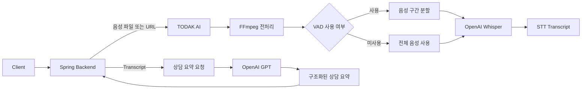

# TODAK AI

> 의료 상담 녹음의 **음성 인식(STT)** 과 **상담 내용 요약**을 담당하는 TODAK 내부 AI 서버입니다.

TODAK AI는 Spring 백엔드에서 전달받은 음성 파일 또는 음성 URL을 텍스트로 변환하고, 변환된 상담 내용을 구조화된 형태로 요약합니다.

## 주요 기능

* 음성 파일 업로드 기반 STT
* 음성 URL 기반 STT
* FFmpeg를 이용한 오디오 전처리
* WebRTC VAD 기반 음성 구간 분할
* 분할 음성의 비동기 병렬 처리
* 일시적 API 오류에 대한 재시도
* GPT 기반 의료 상담 내용 요약
* 내부 API Key를 이용한 서버 간 인증
* 처리 완료 후 임시 파일 자동 삭제

## 시스템 구성



## 기술 스택

| 구분                       | 기술                           |
| ------------------------ | ---------------------------- |
| Language                 | Python                       |
| API Framework            | FastAPI, Uvicorn             |
| STT                      | OpenAI Whisper (`whisper-1`) |
| Summarization            | OpenAI GPT (`gpt-4o-mini`)   |
| Audio Processing         | FFmpeg, FFprobe, pydub       |
| Voice Activity Detection | WebRTC VAD                   |
| Async HTTP               | HTTPX                        |
| Data Validation          | Pydantic                     |
| Deployment               | AWS EC2                      |

## 프로젝트 구조

```text
TODAK-AI/
├── main.py                         # FastAPI 애플리케이션 및 API 라우터
├── config.py                       # 환경 변수 설정
├── requirements.txt                # Python 의존성 목록
├── stt/
│   ├── audio_utils.py              # 오디오 변환 및 메타데이터 추출
│   ├── stt_service.py              # STT 처리, 재시도 및 결과 생성
│   └── vad_utils.py                # VAD 기반 음성 구간 분할
└── summarizer/
    ├── prompt.md                    # 의료 상담 요약 프롬프트
    └── summarizer_service.py       # 상담 내용 요약 처리
```

## 처리 흐름

### STT

1. Spring 백엔드에서 음성 파일 또는 음성 URL을 전달받습니다.
2. 음성을 임시 파일로 저장합니다.
3. FFmpeg를 이용해 Whisper 처리에 적합한 형식으로 변환합니다.
4. VAD가 활성화된 경우 음성 구간을 분리합니다.
5. 각 음성 구간을 OpenAI Whisper로 변환합니다.
6. 구간별 결과를 순서대로 합쳐 전체 transcript를 생성합니다.
7. 처리 과정에서 생성된 임시 파일을 삭제합니다.

### 상담 요약

1. Spring 백엔드에서 `recordingId`와 transcript를 전달받습니다.
2. 의료 상담 요약 프롬프트와 transcript를 GPT 모델에 전달합니다.
3. transcript에 포함된 내용을 바탕으로 한 줄 요약과 상세 상담 내용을 생성합니다.
4. 생성된 요약 결과를 Spring 백엔드에 반환합니다.

## 실행 방법

### 1. 저장소 복제

```bash
git clone https://github.com/SWE-TODAK/TODAK-AI.git
cd TODAK-AI
```

### 2. 가상환경 생성 및 활성화

#### Windows

```powershell
python -m venv .venv
.venv\Scripts\activate
```

#### macOS / Linux

```bash
python3 -m venv .venv
source .venv/bin/activate
```

### 3. 패키지 설치

```bash
pip install -r requirements.txt
```

### 4. FFmpeg 설치 확인

오디오 전처리를 위해 실행 환경에 `ffmpeg`와 `ffprobe`가 설치되어 있어야 합니다.

```bash
ffmpeg -version
ffprobe -version
```

### 5. 환경 변수 설정

프로젝트 루트에 `.env` 파일을 생성합니다.

```dotenv
OPENAI_API_KEY=your-openai-api-key
INTERNAL_API_KEY=your-internal-api-key
```

| 환경 변수              | 필수  | 설명                                        |
| ------------------ | --- | ----------------------------------------- |
| `OPENAI_API_KEY`   | Yes | Whisper 및 GPT API 호출에 사용하는 OpenAI API Key |
| `INTERNAL_API_KEY` | Yes | Spring 백엔드와 AI 서버 간 내부 인증 Key             |

> `.env` 파일과 API Key는 Git 저장소에 커밋하지 않습니다.

### 6. 서버 실행

```bash
uvicorn main:app --reload --host 0.0.0.0 --port 8000
```

서버 실행 후 다음 주소에서 자동 생성된 API 문서를 확인할 수 있습니다.

* Swagger UI: `http://localhost:8000/docs`
* ReDoc: `http://localhost:8000/redoc`

## API

모든 내부 API 요청에는 다음 인증 헤더가 필요합니다.

```http
X-Internal-Key: {INTERNAL_API_KEY}
```

| Method | Endpoint                          | 설명                            |
| ------ | --------------------------------- | ----------------------------- |
| `POST` | `/internal/transcriptions`        | 업로드된 음성 파일을 텍스트로 변환           |
| `POST` | `/internal/transcriptions/by-url` | URL에 저장된 음성 파일을 텍스트로 변환       |
| `POST` | `/internal/summarizes`            | STT transcript를 의료 상담 형식으로 요약 |

요청 필드와 응답 형식에 대한 상세 내용은 Swagger UI에서 확인할 수 있습니다.

## 연동 시 주의사항

STT 처리 실패가 항상 HTTP 오류 상태로 반환되는 것은 아닙니다. Spring 백엔드에서는 HTTP 상태 코드와 함께 다음 메타데이터를 확인해야 합니다.

* `data.meta.fallback`: 정상 STT 결과가 아닌 fallback 응답인지 여부
* `data.meta.jobStatus`: STT 작업 처리 상태
* `data.meta.retryHint`: 재시도가 필요한 오류인지 여부

또한 배포 환경의 파일 업로드 크기 제한은 AI 서버뿐 아니라 Spring 백엔드와 프록시 서버의 설정도 함께 확인해야 합니다.

## 배포

본 프로젝트는 AWS EC2 환경에 배포하여 Spring 백엔드와의 연동 테스트를 완료했습니다.

현재는 AWS 무료 사용 기간 종료에 따른 비용 관리를 위해 EC2 인스턴스를 중지한 상태입니다. 로컬 환경에서 실행하거나 새로운 서버 환경에 재배포할 수 있습니다.

배포 환경에는 다음 항목이 필요합니다.

* `OPENAI_API_KEY`
* `INTERNAL_API_KEY`
* Python 실행 환경
* `ffmpeg` 및 `ffprobe`
* 외부 음성 URL에 접근할 수 있는 네트워크 환경

서버 실행 명령은 다음과 같습니다.

```bash
uvicorn main:app --host 0.0.0.0 --port 8000
```

## 보안 및 운영 유의사항

* API Key를 코드 또는 Git 저장소에 포함하지 않습니다.
* 운영 환경에서는 HTTPS를 사용합니다.
* 음성 파일과 transcript에는 민감한 의료 정보가 포함될 수 있으므로 불필요한 로그 저장을 피합니다.
* 음성 URL은 만료 시간이 설정된 서명 URL 사용을 권장합니다.
* AI가 생성한 요약은 의료진의 최종 판단을 대체하지 않습니다.
